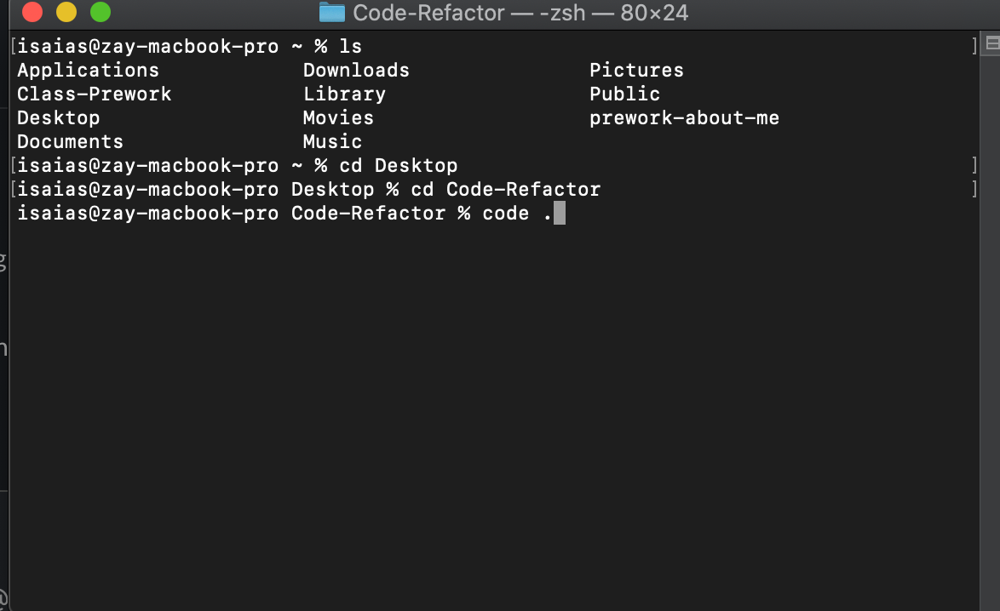
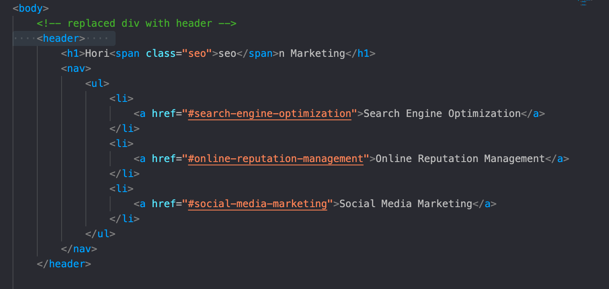

# Code-Refactor

# Project Title

Horiseon Marketing 

## Getting Started

These instructions will get you a copy of the project up and running on your local machine for development and testing purposes. See deployment for notes on how to deploy the project on a live system. 

### Prerequisites

What things you need to install the software and how to install them
-Laptop 
-Github account 
-Terminal 
-Gitbash for PC
-Download code editor such as Visual studio code or Atom 

### Installing
<body>

 -Create GitHub account  

 -Go to your terminal and setup GitHub SSH 
 

 -Follow this link:https://help.github.com/en/github/authenticating-to-github/adding-a-new-ssh-key-to-your-github-account

 -Once you've completed creating ssh here's the link for Horiseon Marketing: https://github.com/idelmundo/Code-Refactor 

 -Clone SSH key and save the file in your desktop or documnet.

 -Open terminal and go to the folder you've created 
 for example:
  
from here Visual code should open with the folder on the side bar. 

 

</body>

### Line by line changes 
<body>

 When I recieved this code I didn't see any HTML semantic elements. So I've replaced a bunch of Divs to a semantic elements to make it easier to read. Here an example:

   

 In the picture above, on line 13 and 15 these were div at first and i've replaced it to header and nav that way when others read it they know what they are. 

  

This section is called service due to the picture shown and how it was being promoted. I've replaced the div to section and added a class name to organize css stylesheet later on. I also added alt on images so if the link is broken it can look for an image similar to it. 

  

 This section is called benefit since they're explaining how it will help the company over time. I've replaced the divs to aside and aritlce to be in semantic form. This also didn't have any footer which i added so people would know that this is the end.
  
</body>

As for stylesheets I removed all the repetition style and made it to one class to reduce clutter. I also tried make it in alpahbetical order and made section to make it easier to style. 

## Built With

* [HTML](https://developer.mozilla.org/en-US/docs/Web/HTML)
* [CSS](https://developer.mozilla.org/en-US/docs/Web/CSS)

## Deployed Link

* [See Live Site](#)

## Authors

* **YOUR NAME** 
Isaias Del Mundo 
- [Link to Portfolio Site](#)
- [Link to Github](https://github.com/idelmundo)
- [Link to LinkedIn](https://www.linkedin.com/in/isaiasdelmundo/)

See also the list of [contributors](https://github.com/your/project/contributors) who participated in this project.

## License

This project is licensed under the YAY AREA License 

## Acknowledgments

* MDN web docs 
* UCBExtension 
* GOOGLE
